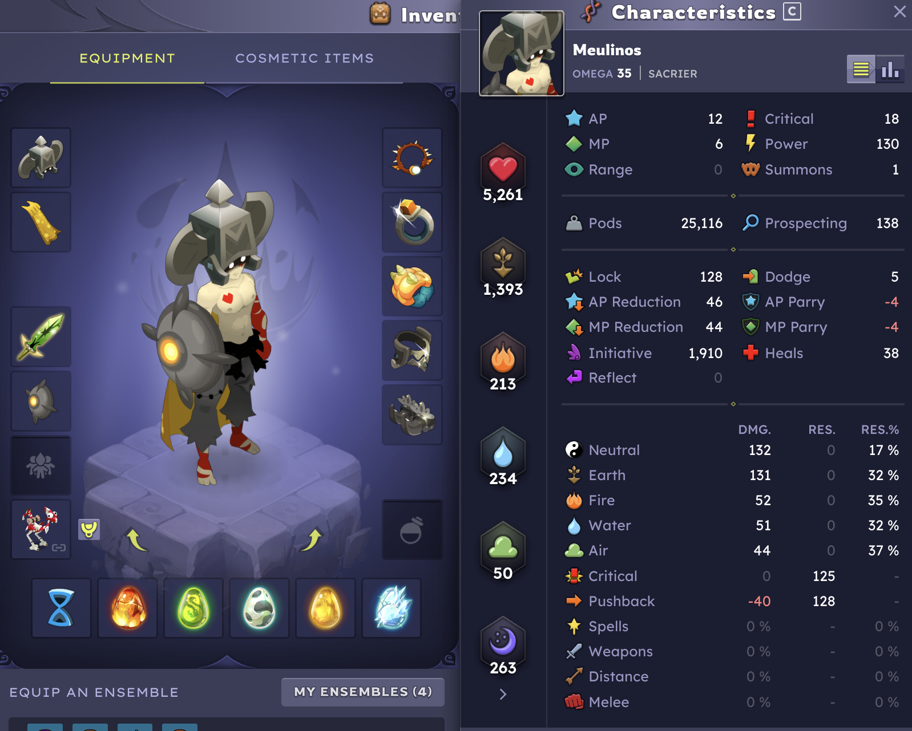

The build module implements a tool that searches for the best "character builds" given user-defined constraints.

In [Dofus](https://www.dofus.com/), a character’s power comes from several sources:

- Base characteristics: Strength, Agility, Vitality, etc. (allocated with points per level)
- Equipment: Amulet, Belt, Boots, Weapon, etc.
- Pet or Mount
- Six Dofus or trophies

All these bonuses stack together to produce the final character stats you see in the character sheet.

To keep things manageable, the first version of the build optimizer will focus exclusively on the nine main gear slots:

- Amulet
- Belt
- Boots
- Cloak
- Hat
- Ring 1
- Ring 2
- Shield
- Weapon

This is the most complex part of a build, because some items belong to sets — equipping multiple pieces of the same set 
grants extra set bonuses. Other sources of characteristics (pet, Dofus, trophies, stat points) are independent and can
be tuned afterward to strengthen an already-good gear selection. That’s something players are familiar with, and it's
much simpler algorithmically.

The Build CLI will take user-specified constraints, such as:

- Vitality >= 3000
- Strength >= 800
- Level <= 198 

and then output a handful of builds (if any exist) that satisfy these requirements. The core challenge is implementing
the algorithm that explores all viable gear combinations.